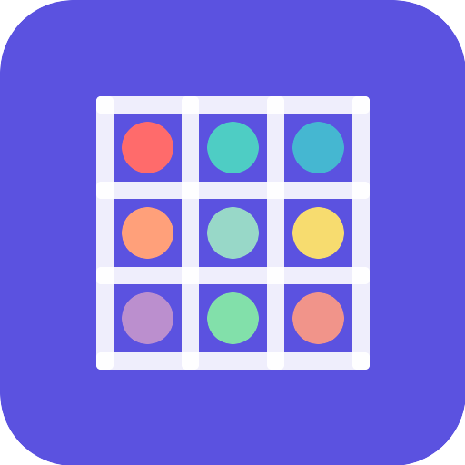

# Real Filters

<div align="center">



**A powerful image filtering app that reveals the mathematics behind visual effects.**

[](https://developer.android.com/about/versions/nougat)
[](https://kotlinlang.org)
[](https://developer.android.com/jetpack/compose)
[](LICENSE)

[Download APK](https://github.com/Shuvam-Banerji-Seal/real_filters/releases) | [Website](https://shuvam-banerji-seal.github.io/real_filters/)

</div>

---

## What is Real Filters?

Real Filters is an educational Android app that demystifies image processing by showing you exactly how filters work as mathematical operations. Every sepia tone, every blur, every edge detection effect is just a matrix applied to your image's pixels.

### Key Features

- **Load Any Image** - Supports JPEG, PNG, GIF, BMP, WebP, TIFF, HEIF, and SVG formats
- **See the Math** - Every filter displays its underlying matrix or kernel values
- **Color Matrix Filters** - Sepia, grayscale, invert, brightness, contrast, saturation, and more
- **Convolution Kernels** - Sharpen, blur, Gaussian blur, edge detection, emboss
- **Custom Matrices** - Write your own 4×5 color matrices or NxN convolution kernels
- **Layer System** - Stack multiple filters with adjustable opacity and reorder
- **Matrix Composition** - Multiply matrices together to combine effects mathematically
- **Export/Import** - Save filters as JSON, share with others
- **Preset Library** - 13 color matrices and 8 convolution kernels built in
- **Dark Mode** - Full Material You theming support

## How It Works

### Color Matrices

A color matrix is a 4×5 matrix applied to each pixel's RGBA values:

```
| R' |   | m00 m01 m02 m03 m04 |   | R |
| G' | = | m10 m11 m12 m13 m14 | × | G |
| B' |   | m20 m21 m22 m23 m24 |   | B |
| A' |   | m30 m31 m32 m33 m34 |   | A |
                                     | 1 |
```

For example, **Sepia** uses:
```
| 0.393  0.769  0.189  0  0 |
| 0.349  0.686  0.168  0  0 |
| 0.272  0.534  0.131  0  0 |
| 0      0      0      1  0 |
```

### Convolution Kernels

A convolution kernel slides over each pixel, combining it with its neighbors:

```
Sharpen:          Edge Detect:
| 0  -1   0 |    | -1  -1  -1 |
|-1   5  -1 |    | -1   8  -1 |
| 0  -1   0 |    | -1  -1  -1 |
```

## Architecture

```
com.realfilters.app/
├── data/
│   ├── db/          # Room database (DAO, entities)
│   ├── model/       # Data models, export/import formats
│   └── repository/  # Filter repository
├── di/              # Hilt dependency injection
├── domain/
│   ├── engine/      # Image processing engine, image loader
│   └── filter/      # Preset filter definitions
└── ui/
    ├── screens/     # Compose screens, ViewModel
    └── theme/       # Material3 theming
```

### Tech Stack

| Component | Technology |
|-----------|-----------|
| UI | Jetpack Compose + Material3 |
| Architecture | MVVM |
| DI | Hilt |
| Database | Room |
| Image Loading | Coil + AndroidSVG + Apache Commons Imaging |
| Serialization | Gson |

## Building

### Prerequisites

- JDK 17+
- Android SDK 36
- Gradle 8.11+

### Debug Build

```bash
./gradlew assembleDebug
```

### Release Build

```bash
# Set environment variables
export KEYSTORE_PATH=keystore/release.jks
export KEYSTORE_PASSWORD=your_password
export KEY_ALIAS=realfilters
export KEY_PASSWORD=your_key_password

./gradlew assembleRelease
```

## Testing

```bash
# Unit tests
./gradlew test

# Instrumented tests (requires emulator)
./gradlew connectedAndroidTest
```

## Screenshots

<div align="center">
<p><em>Screenshots will be added in the assets folder</em></p>
</div>

## Contributing

1. Fork the repository
2. Create a feature branch (`git checkout -b feature/amazing-filter`)
3. Commit your changes (`git commit -m 'Add amazing filter'`)
4. Push to the branch (`git push origin feature/amazing-filter`)
5. Open a Pull Request

## License

This project is licensed under the MIT License - see the [LICENSE](LICENSE) file for details.

## Acknowledgments

- Android Jetpack team for Compose and Material3
- Apache Commons for image format support
- The image processing community for filter algorithms

---

<div align="center">

**Built with Kotlin and Jetpack Compose**

</div>
